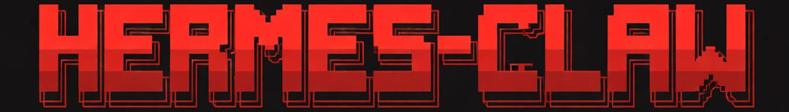
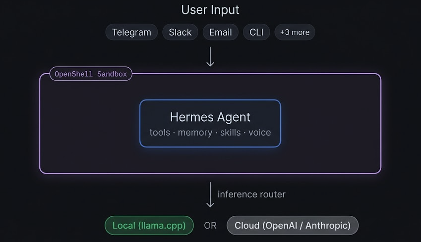

<p align="center">
  
</p>

<p align="center">
  <a href="https://github.com/TheAiSingularity/hermesclaw/actions/workflows/ci.yml"></a>
  <a href="https://github.com/TheAiSingularity/hermesclaw/blob/main/LICENSE"></a>
  <a href="https://github.com/TheAiSingularity/hermesclaw/blob/main/CONTRIBUTING.md"></a>
  <a href="https://github.com/TheAiSingularity/hermesclaw/blob/main/CHANGELOG.md"></a>
</p>

**Hermes Agent (NousResearch) running inside NVIDIA OpenShell.**

NVIDIA built OpenShell to hardware-enforce AI agent behavior — blocking network egress, filesystem writes, and dangerous syscalls at the kernel level. HermesClaw is a community implementation that puts Hermes Agent inside the same sandbox. The agent gets its full capability stack while the OS enforces hard limits. If a skill goes rogue, the kernel stops it.

---

## Table of Contents

- [Architecture](#architecture)
- [Quick Start](#quick-start)
  - [Recommended — one-command install](#recommended--one-command-install)
  - [Build from source](#build-from-source-if-you-want-to-modify-hermesclaw-itself)
  - [OpenShell sandbox (full hardware enforcement)](#openshell-sandbox-full-hardware-enforcement)
- [What OpenShell Enforces](#what-openshell-enforces)
- [Policy Tiers & Presets](#policy-tiers--presets)
- [Hermes Features](#hermes-features-inside-the-sandbox)
- [Skills Library](#skills-library)
- [Use Cases](#use-cases)
- [HermesClaw vs NemoClaw](#hermesclaw-vs-nemoclaw)
- [CLI Reference](#hermesclaw-cli)
- [Personalise Hermes](#personalise-hermes)
- [Project Structure](#project-structure)
- [Diagnostics & Testing](#diagnostics--testing)
- [Contributing](#contributing)
- [Related Projects](#related)

---

## Architecture

<p align="center">
  
</p>

OpenShell intercepts every call to `inference.local` inside the sandbox and routes it to the configured backend. Hermes never knows it's sandboxed.

---

## Quick Start

### Recommended — one-command install

Clones the repo to `~/.hermesclaw`, installs Node.js (via nvm) if needed, builds the `hermesclaw` CLI, and launches the interactive **onboard wizard** which walks you through provider selection, model configuration, policy tier, and sandbox creation:

```bash
curl -fsSL https://raw.githubusercontent.com/TheAiSingularity/hermesclaw/main/scripts/install.sh | bash
```

Prerequisites: `docker`, `git`, `curl`. Docker Desktop (macOS / Windows) or `dockerd` (Linux) must be running. Node.js >= 20 is installed automatically if missing.

The onboard wizard configures everything interactively. Once complete:

```bash
hermesclaw mybot chat "hello"
hermesclaw list                    # see all sandboxes
hermesclaw mybot snapshot create   # point-in-time backup
```

To re-run onboard later (e.g. switch providers): `hermesclaw onboard`.

---

### Build from source (if you want to modify HermesClaw itself)

```bash
git clone https://github.com/TheAiSingularity/hermesclaw
cd hermesclaw
cd cli && npm install && npm run build && npm link && cd ..
hermesclaw onboard
```

---

### OpenShell sandbox (full hardware enforcement)

Requires Linux + NVIDIA GPU + OpenShell installed.

```bash
# Install OpenShell (requires NVIDIA account)
curl -fsSL https://www.nvidia.com/openshell.sh | bash

# Install HermesClaw via the one-liner above — the onboard wizard
# detects OpenShell and configures the sandbox automatically.
hermesclaw mybot chat "hello"
hermesclaw list                                 # see all sandboxes
hermesclaw mybot snapshot create                # point-in-time backup
```

Full CLI reference: [hermesclaw CLI](#hermesclaw-cli). Diagnostics: `hermesclaw doctor`.

---

## What OpenShell Enforces

| Layer | Mechanism | Rule |
|-------|-----------|------|
| **Network** | OPA + HTTP CONNECT proxy | Egress to approved hosts only — all else blocked |
| **Filesystem** | Landlock LSM | `~/.hermes/` + `/sandbox/` + `/tmp/` only |
| **Process** | Seccomp BPF | `ptrace`, `mount`, `kexec_load`, `perf_event_open`, `process_vm_*` blocked |
| **Inference** | Privacy router | Credentials stripped from agent; backend credentials injected by OpenShell |

All four layers are enforced **out-of-process** — even a fully compromised Hermes instance cannot override them.

---

## Policy Tiers & Presets

The onboard wizard selects a **policy tier** which determines the default set of network presets. You can add or remove individual presets at any time **without restarting** the sandbox:

```bash
hermesclaw mybot policy add github     # allow GitHub API access
hermesclaw mybot policy remove slack   # revoke Slack access
hermesclaw mybot policy list           # show active presets
```

### Tiers (selected during onboard)

| Tier | Default Presets | Description |
|------|----------------|-------------|
| `restricted` | *(none)* | Inference only — no external network access |
| `balanced` | npm, pypi, huggingface, brave, github | Development + research |
| `open` | balanced + slack, discord, telegram | Full messaging + development |

### Available Presets

| Preset | Access Granted |
|--------|---------------|
| `npm` | npm / Yarn registries |
| `pypi` | PyPI package index |
| `huggingface` | Hugging Face Hub + CDN |
| `brave` | Brave Search API |
| `github` | GitHub API + raw content |
| `slack` | Slack API + websocket gateway |
| `discord` | Discord API + gateway + CDN |
| `telegram` | Telegram Bot API |

Presets are composable YAML fragments in `openshell/presets/`. Each is merged with `openshell/baseline.yaml` to produce the active policy.

---

## Hermes Features Inside the Sandbox

| Feature | Status | Notes |
|---------|:------:|-------|
| `hermes chat` | ✅ | Routes via `inference.local` → llama.cpp |
| Persistent memory (MEMORY.md + USER.md) | ✅ | Volume-mounted on host, survives sandbox recreation |
| Self-improving skills | ✅ | DSPy + GEPA optimisation, stored in `~/.hermes/skills/` |
| 40+ built-in tools | ✅ | Terminal, file, vision, voice, browser, RL, image gen, etc. |
| Cron / scheduled tasks | ✅ | `hermes cron create` |
| Multi-agent delegation | ✅ | `hermes delegate_task` |
| MCP server integration | ✅ | `hermes mcp` |
| IDE integration (ACP) | ✅ | VS Code, JetBrains, Zed |
| Python SDK | ✅ | `from run_agent import AIAgent` |
| Telegram / Discord gateway | ✅ | Requires `gateway` or `permissive` policy |
| Signal / Slack / WhatsApp / Email | ✅ | Requires `permissive` policy |
| Voice notes (all platforms) | ✅ | Auto-transcribed before passing to model |
| Web search | ✅ | Requires `permissive` policy (DuckDuckGo) |

---

## Skills Library

Pre-built skills that encode recurring workflows. Install with one command, invoke via chat:

```bash
./skills/install.sh research-digest     # weekly arXiv digest → Telegram
./skills/install.sh code-review         # local code review (CLI or VS Code ACP)
./skills/install.sh anomaly-detection   # daily DB anomaly detection → Slack/Telegram
./skills/install.sh market-alerts       # watchlist price alerts → Telegram
./skills/install.sh slack-support       # Slack support bot with knowledge base
./skills/install.sh home-assistant      # natural language smart home control
./skills/install.sh --all               # install everything
```

After installing, invoke from chat or any connected messaging platform:
```bash
hermesclaw mybot chat "run research-digest"
# or in Telegram: "run the anomaly-detection skill"
```

Full index: [skills/README.md](skills/)

---

## Use Cases

Seven end-to-end guides covering real deployment scenarios — each with prerequisites, setup steps, automated tests, and a NemoClaw comparison:

| Who | Setup | Guide |
|-----|-------|-------|
| Researcher / writer | Docker + Telegram + weekly arXiv digest | [01-researcher](docs/use-cases/01-researcher/) |
| Developer | Docker + VS Code ACP | [02-developer](docs/use-cases/02-developer/) |
| Home automation | Docker + Home Assistant MCP + Telegram | [03-home-automation](docs/use-cases/03-home-automation/) |
| Data analyst | Docker + Postgres MCP + anomaly alerts | [04-data-analyst](docs/use-cases/04-data-analyst/) |
| Small business | Docker + Slack support bot + knowledge base | [05-small-business](docs/use-cases/05-small-business/) |
| Privacy-regulated | OpenShell sandbox + strict policy (HIPAA/legal) | [06-privacy-regulated](docs/use-cases/06-privacy-regulated/) |
| Trader / quant | Docker + local model + Telegram price alerts | [07-trader](docs/use-cases/07-trader/) |

Full index and NemoClaw compatibility table: [docs/use-cases/](docs/use-cases/)

---

## HermesClaw vs NemoClaw

Full comparison and test results: [docs/test-results.md](docs/test-results.md) · [docs/test-results-uc.md](docs/test-results-uc.md)

| | HermesClaw | NemoClaw |
|---|---|---|
| **Agent** | Hermes (NousResearch) | OpenClaw (wrapped by NemoClaw) |
| **Sandbox** | OpenShell | OpenShell |
| **Tools** | 40+ (web, browser, vision, voice, RL, …) | 25+ via OpenClaw |
| **Memory** | Persistent MEMORY.md + USER.md | Session only — no cross-session persistence |
| **Self-improving skills** | Yes (DSPy + GEPA) | No |
| **Messaging** | Telegram, Discord, Signal, Slack, WhatsApp, Email | Telegram, Discord, Slack, WhatsApp, Signal, Teams (via OpenClaw) |
| **MCP servers** | Yes | Unconfirmed |
| **IDE integration** | VS Code, JetBrains, Zed (ACP) | OpenClaw-native (not ACP) |
| **Inference providers** | llama.cpp, NVIDIA NIM, OpenAI, Anthropic, Ollama, vLLM | OpenAI, Anthropic, Gemini, NVIDIA NIM, local (Linux only) |
| **macOS local inference** | ✅ Works | ❌ Broken (DNS bug, issue #260) |
| **Without NVIDIA GPU** | ✅ CPU Docker mode | ✅ Cloud inference |
| **Status** | Community implementation | NVIDIA official (alpha) |

---

## hermesclaw CLI

Sandboxes are named. Use `hermesclaw <name> <command>` or omit the name to use the default.

```
GLOBAL COMMANDS
  hermesclaw onboard                    First-time setup wizard (provider, model, policy, sandbox)
  hermesclaw list                       List registered sandboxes
  hermesclaw backup-all                 Snapshot every registered sandbox
  hermesclaw doctor [--quick]           End-to-end diagnostic
  hermesclaw credentials [list|reset]   Manage stored API keys
  hermesclaw version                    Print version
  hermesclaw uninstall                  Remove HermesClaw (data preserved)

SANDBOX COMMANDS  (hermesclaw [<name>] <command>)
  start [--gpu]                         Create and start sandbox via OpenShell
  stop                                  Stop sandbox (memories + skills preserved)
  status                                Show inference config + memory/skill counts
  connect                               Open interactive shell inside sandbox
  logs [--follow]                       Stream sandbox logs
  destroy                               Remove sandbox (memories preserved in snapshots)
  chat "prompt"                         One-shot message to Hermes

POLICY COMMANDS  (hermesclaw [<name>] policy <subcommand>)
  policy list                           Show active presets for this sandbox
  policy add PRESET                     Enable a network preset (e.g. github, slack)
  policy remove PRESET                  Disable a network preset

LIFECYCLE COMMANDS  (hermesclaw [<name>] <command>)
  snapshot [create|list|restore [PREFIX]]  Manage point-in-time snapshots
  backup                                Alias for snapshot create
  restore [PREFIX]                      Alias for snapshot restore
  rebuild                               Snapshot → destroy → recreate → restore

EXAMPLES
  hermesclaw onboard
  hermesclaw mybot chat "Hello Hermes"
  hermesclaw mybot policy add github
  hermesclaw mybot snapshot create
  hermesclaw mybot rebuild
  hermesclaw list
  hermesclaw backup-all
```

---

## Personalise Hermes

```bash
cp configs/persona.yaml.example configs/persona.yaml
```

Edit `configs/persona.yaml` — set your name, role, expertise, ticker watchlist, and response style. Hermes loads this into every session. For deeper personalisation, edit `~/.hermes/SOUL.md` — this goes directly into the system prompt.

---

## Project Structure

```
hermesclaw/
├── .github/
│   └── workflows/
│       └── ci.yml                      # Syntax, lint, and test CI
├── Dockerfile                          # Hermes Agent (pinned base image + build ARGs)
├── .env.example                        # CTX_SIZE (llama-server only, ignored by Ollama), bot tokens
├── cli/                                # Node.js/TypeScript CLI (hermesclaw command)
│   ├── package.json                   # hermesclaw npm package
│   ├── tsconfig.json
│   ├── vitest.config.ts
│   └── src/
│       ├── index.ts                   # Commander entry point
│       ├── commands/                  # onboard, chat, policy, doctor, etc.
│       └── lib/                       # registry, credentials, policy, providers, etc.
├── openshell/
│   ├── baseline.yaml                  # Base sandbox policy (filesystem, process, inference)
│   ├── tiers.yaml                     # Tier definitions (restricted, balanced, open)
│   ├── presets/                       # Composable network presets
│   │   ├── npm.yaml                   # npm / Yarn registries
│   │   ├── pypi.yaml                  # PyPI
│   │   ├── brave.yaml                 # Brave Search API
│   │   ├── huggingface.yaml           # Hugging Face Hub
│   │   ├── github.yaml                # GitHub API
│   │   ├── slack.yaml                 # Slack API + websocket
│   │   ├── discord.yaml               # Discord API + gateway
│   │   └── telegram.yaml              # Telegram Bot API
│   ├── hermesclaw-policy.yaml         # Legacy default policy
│   ├── hermesclaw-profile.yaml        # Sandbox profile
│   ├── policy-strict.yaml             # Legacy: inference only
│   ├── policy-gateway.yaml            # Legacy: inference + messaging
│   └── policy-permissive.yaml         # Legacy: everything
├── configs/
│   ├── hermes.yaml.example            # Full Hermes config
│   └── persona.yaml.example           # User persona
├── skills/
│   ├── install.sh                     # Skill installer
│   ├── anomaly-detection/             # DB anomaly detection (detect.py)
│   ├── market-alerts/                 # Price threshold alerts (monitor.py)
│   ├── code-review/                   # Code review prompts
│   ├── slack-support/                 # FAQ + escalation bot
│   ├── home-assistant/                # HA MCP control
│   └── research-digest/               # Weekly arXiv digest
├── scripts/
│   └── install.sh                     # One-command installer (curl | bash)
├── benchmarks/
│   ├── compare-features.sh            # HermesClaw vs NemoClaw feature matrix
│   ├── compare-setup.sh              # Comparison test environment setup
│   └── uc-01.sh … uc-07.sh           # Per-use-case comparison scripts
├── docs/
│   ├── use-cases/                     # 7 end-to-end use-case guides
│   ├── features.md                    # Full feature reference
│   ├── test-results.md                # Feature comparison table
│   └── test-results-uc.md             # Use-case comparison results
├── knowledge/                         # Drop documents here (RAG context, read-only mount)
└── models/                            # Drop .gguf model weights here
```

---

## Diagnostics & Testing

```bash
# Check your environment (provider-aware inference health, policy validation, etc.)
hermesclaw doctor              # full diagnostic
hermesclaw doctor --quick      # skip slow checks (chat smoke test, DNS probe)

# Run CLI unit tests
cd cli && npm test

# HermesClaw vs NemoClaw comparison benchmarks
bash benchmarks/compare-features.sh          # generates docs/test-results.md
bash benchmarks/compare-features.sh --quick  # skip live inference probes
bash benchmarks/compare-setup.sh             # set up comparison environment
bash benchmarks/uc-01.sh                     # researcher use case
bash benchmarks/uc-04.sh                     # data analyst (Postgres + anomaly detection)
bash benchmarks/uc-07.sh                     # trader (latency measurement)
```

---

## Contributing

HermesClaw welcomes contributions — especially:

- **OpenShell policy corrections** — if you have access to a real OpenShell environment, correctness fixes are the highest-value contribution
- **New policy presets** — homeassistant, coding, research, etc.
- **New skills** — follow the `SKILL.md` format in any existing skill as a template
- **Real-world test reports** — if you've run HermesClaw on NVIDIA hardware, share your `hermesclaw doctor` output

**Quick contributor setup:**
```bash
git clone https://github.com/TheAiSingularity/hermesclaw
cd hermesclaw
cd cli && npm install && npm test && cd ..   # build + test the CLI
hermesclaw doctor --quick                    # verify your environment
```

Full guide: [CONTRIBUTING.md](CONTRIBUTING.md) · [Code of Conduct](CODE_OF_CONDUCT.md) · [Changelog](CHANGELOG.md)

---

## Related

- [hermes-agent-nemoclaw-openclaw](https://github.com/TheAiSingularity/hermes-agent-nemoclaw-openclaw) — The parent repo: Hermes + NemoClaw + lightweight bots in one stack
- [Hermes Agent](https://github.com/NousResearch/hermes-agent) — NousResearch's agent (18k ⭐)
- [NemoClaw](https://github.com/NVIDIA/NemoClaw) — NVIDIA's OpenClaw + OpenShell reference implementation
- [OpenShell](https://docs.nvidia.com/openshell/latest/) — NVIDIA's hardware-enforced AI sandbox
